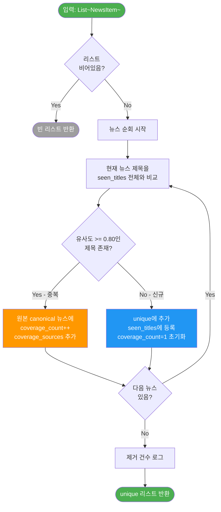

# 중복제거 알고리즘 상세 설명

> 대상 파일: `src/preprocessor/dedup.py`
> 작성일: 2026-03-07

---

## 1. 개요

수집된 뉴스는 여러 소스(네이버, Yahoo, Google News 등)에서 **동일 사건을 다른 제목으로** 보도하는 경우가 빈번하다. 중복제거 모듈은 이를 탐지하여 하나의 대표 뉴스(canonical)만 남기고, 나머지는 **보도량 메타데이터**로 병합한다.

**핵심 역할:**
- 동일/유사 뉴스 제거 → 랭킹 입력 품질 향상
- 중복 보도 수(coverage_count)를 랭킹 스코어링에 활용 (다매체 보도 = 높은 영향력)

---

## 2. 사용 알고리즘: SequenceMatcher

### 2.1 라이브러리

```python
from difflib import SequenceMatcher
```

Python 표준 라이브러리 `difflib`의 `SequenceMatcher`를 사용한다. 외부 의존성 없음.

### 2.2 유사도 계산 공식

```python
def similarity(a: str, b: str) -> float:
    return SequenceMatcher(None, a, b).ratio()
```

`ratio()` 반환값:

```
유사도 = 2.0 * M / T
```

| 기호 | 의미 |
|------|------|
| `M` | 두 문자열의 **최장 공통 부분 수열(LCS)** 에서 매칭된 총 문자 수 |
| `T` | 두 문자열의 길이 합 (`len(a) + len(b)`) |

반환 범위: `0.0` (완전 상이) ~ `1.0` (완전 동일)

### 2.3 SequenceMatcher 내부 동작

`SequenceMatcher`는 단순 LCS가 아니라 **Ratcliff/Obershelp 알고리즘**을 사용한다:

1. 두 문자열에서 **가장 긴 공통 부분 문자열(Longest Common Substring)** 을 찾는다
2. 이 부분 문자열을 기준으로 **왼쪽/오른쪽을 재귀적으로** 다시 매칭한다
3. 모든 매칭 블록의 문자 수를 합산하여 `M`을 계산한다

```
예시:
  A = "삼성전자 Q4 매출 50% 증가"
  B = "삼성전자, Q4 매출 전년대비 50% 증가 전망"

  1단계: 최장 공통 = "삼성전자" (4자)
  2단계: 오른쪽에서 " Q4 매출 " (6자)
  3단계: 오른쪽에서 "50% 증가" (5자)
  ...
  M = 약 18자, T = 15 + 22 = 37
  유사도 = 2 * 18 / 37 ≈ 0.97
```

### 2.4 SequenceMatcher의 `None` 파라미터

```python
SequenceMatcher(None, a, b)
```

첫 번째 인자 `None`은 **isjunk 함수**를 지정하지 않는다는 뜻이다. 모든 문자를 비교 대상으로 포함한다.

(공백이나 특수문자를 junk로 처리하면 `lambda x: x == " "`처럼 전달 가능)

---

## 3. 중복 판정 기준

### 3.1 임계값

```python
threshold: float = 0.8  # 80%
```

| 유사도 범위 | 판정 | 예시 |
|------------|------|------|
| >= 0.80 | **중복** | "삼성전자 Q4 매출 증가" vs "삼성전자, Q4 매출 증가 전망" |
| < 0.80 | **별개 뉴스** | "삼성전자 매출 증가" vs "SK하이닉스 실적 부진" |

### 3.2 80%를 선택한 이유

| 수치 | 장단점 |
|------|--------|
| 90% 이상 | 너무 엄격 → 같은 사건의 약간 다른 제목이 중복으로 잡히지 않음 |
| **80%** | 균형점 → 같은 사건의 다른 표현은 잡되, 다른 사건은 보존 |
| 70% 이하 | 너무 느슨 → 다른 사건인데 공통 단어만 많으면 중복 처리 |

### 3.3 유사도 계산 예시

```
# 중복 판정 (>= 0.80)
"삼성전자, 4분기 영업이익 12조원 돌파"
"삼성전자 4분기 영업이익 12조원 넘어"
→ 유사도: 0.87 ✓ 중복

# 중복 판정 (>= 0.80)
"TSLA earnings beat estimates in Q4"
"Tesla Q4 earnings beat analyst estimates"
→ 유사도: 0.82 ✓ 중복

# 별개 뉴스 (< 0.80)
"삼성전자 반도체 실적 호조"
"SK하이닉스 HBM 수주 확대"
→ 유사도: 0.31 ✗ 별개

# 경계 사례
"현대차 전기차 판매 증가"
"현대자동차 EV 판매량 급증 전망"
→ 유사도: ~0.65 ✗ 별개 (매칭 실패 가능성)
```

---

## 4. 알고리즘 흐름 상세

### 4.1 자료 구조

```python
unique = []          # 중복 제거된 최종 결과 리스트
seen_titles = []     # (제목, unique 리스트 인덱스) 쌍의 리스트
```

### 4.2 처리 흐름



### 4.3 단계별 실행 예시

입력 4건:

| 순서 | 소스 | 제목 |
|------|------|------|
| A | naver | "삼성전자 Q4 매출 50% 증가" |
| B | yahoo | "삼성전자, Q4 매출 전년대비 50% 증가" |
| C | google | "SK하이닉스 HBM 수주 사상 최대" |
| D | rss | "삼성전자 4분기 매출 50% 급증 전망" |

**처리 과정:**

```
[뉴스 A 처리]
  seen_titles = [] (비어있음)
  → 신규 등록
  unique = [A]
  seen_titles = [("삼성전자 Q4 매출 50% 증가", 0)]
  A.extra = {coverage_count: 1, coverage_sources: ["naver"]}

[뉴스 B 처리]
  A와 비교: similarity("삼성전자, Q4 매출 전년대비 50% 증가", "삼성전자 Q4 매출 50% 증가") = 0.85
  0.85 >= 0.80 → 중복! matched_idx = 0
  → A에 병합
  A.extra = {coverage_count: 2, coverage_sources: ["naver", "yahoo"]}
  B는 버림

[뉴스 C 처리]
  A와 비교: similarity("SK하이닉스 HBM 수주 사상 최대", "삼성전자 Q4 매출 50% 증가") = 0.22
  0.22 < 0.80 → 불일치
  → 신규 등록
  unique = [A, C]
  seen_titles = [("삼성전자...", 0), ("SK하이닉스...", 1)]
  C.extra = {coverage_count: 1, coverage_sources: ["google"]}

[뉴스 D 처리]
  A와 비교: similarity("삼성전자 4분기 매출 50% 급증 전망", "삼성전자 Q4 매출 50% 증가") = 0.81
  0.81 >= 0.80 → 중복! matched_idx = 0
  → A에 병합
  A.extra = {coverage_count: 3, coverage_sources: ["naver", "yahoo", "rss"]}
  D는 버림
```

**최종 결과:**

| 뉴스 | coverage_count | coverage_sources |
|------|---------------|-----------------|
| A "삼성전자 Q4 매출 50% 증가" | 3 | naver, yahoo, rss |
| C "SK하이닉스 HBM 수주 사상 최대" | 1 | google |

입력 4건 → 출력 2건 (2건 중복 제거)

---

## 5. 보도량 메타데이터 활용

중복제거에서 생성된 `coverage_count`는 **랭킹 엔진의 Coverage Score**에 직접 사용된다.

### 5.1 Coverage Score 산출 (ranking/engine.py)

```python
coverage_score = min(25, coverage_count * 8)
```

| coverage_count | coverage_score | 의미 |
|---------------|---------------|------|
| 1 (단독 보도) | 8점 | 한 매체만 보도 |
| 2 | 16점 | 2개 매체 보도 |
| 3 | 24점 | 3개 매체 보도 |
| 4+ | **25점 (상한)** | 다수 매체 보도 = 주요 뉴스 |

### 5.2 전체 스코어링에서의 비중

Coverage Score는 총점 100점 중 **최대 25점(25%)** 을 차지한다:

```
총점 = Coverage(0~25) + Keyword(0~25) + Source(0~25) + Market(0~25)
```

즉, 3개 이상 매체에서 동시 보도된 뉴스는 **그것만으로 24~25점**을 확보하여 상위 랭킹에 유리해진다.

---

## 6. 시간 복잡도 분석

### 6.1 비교 횟수

```
N = 전체 뉴스 수
U = 유니크 뉴스 수 (결과)
```

| 케이스 | 비교 횟수 | 설명 |
|--------|----------|------|
| 최선 (전부 중복) | O(N) | 매번 첫 번째와 매칭되어 즉시 break |
| 최악 (전부 신규) | O(N * U) = O(N²) | 매번 seen_titles 전체를 순회 |
| **평균 (실측)** | **O(N * U/2)** | 297건 입력 → 257건 유니크 기준 약 38,000회 비교 |

### 6.2 SequenceMatcher 단일 비교 비용

```
O(n * m)  (n, m = 두 제목의 길이)
```

뉴스 제목은 대체로 20~80자이므로 단일 비교는 매우 빠르다.

### 6.3 현재 규모에서의 성능

| 항목 | 수치 |
|------|------|
| 입력 | ~300건 |
| 유니크 | ~260건 |
| 비교 횟수 | ~38,000회 |
| 제목 평균 길이 | ~40자 |
| **예상 처리 시간** | **< 1초** |

1,000건 이상에서는 성능 저하가 발생할 수 있으며, 그 경우 TF-IDF 벡터화 + 코사인 유사도 등으로 개선 가능.

---

## 7. 설계 특성 및 한계

### 7.1 설계 특성

| 특성 | 설명 |
|------|------|
| **선착순 원칙** | 먼저 입력된 뉴스가 canonical(대표)이 됨. 수집 순서에 영향 |
| **첫 매칭 break** | 한 뉴스가 여러 기존 뉴스와 유사할 수 있지만, 첫 매칭만 채택 |
| **소스 중복 방지** | 같은 소스가 coverage_sources에 중복 추가되지 않음 (32행 `if item.source not in sources`) |
| **제목만 비교** | 본문(content)은 비교에 사용하지 않음 → 빠르지만 정확도 한계 |

### 7.2 한계

| 한계 | 상세 | 영향 |
|------|------|------|
| **제목만 비교** | 제목이 다르지만 같은 사건인 경우 놓침 | false negative |
| **언어 혼재** | 한국어/영어에 동일 80% 기준 적용 | 영어는 동의어 변환이 많아 더 낮은 임계값이 필요할 수 있음 |
| **선착순 편향** | A≈B이고 A≈C이지만 B≉C인 경우, B와 C가 같은 A에 병합됨 | 관련 없는 뉴스가 하나의 coverage에 묶일 가능성 (매우 드뭄) |
| **O(N²) 최악** | 유니크 뉴스가 많을수록 비교 횟수 급증 | 현재 300건 규모에서는 무시 가능, 1000건+ 시 최적화 필요 |
| **부분 문자열 매칭 없음** | "삼성전자" vs "삼성전자우" 같은 관계는 고려하지 않음 | 우선주/보통주 뉴스가 별개로 처리될 수 있음 |

### 7.3 개선 방안 (미적용)

| 방안 | 효과 | 복잡도 |
|------|------|--------|
| TF-IDF + 코사인 유사도 | 대규모 처리 성능 개선 (벡터화 후 행렬 연산) | 중 |
| 본문 포함 비교 | 제목이 다른 동일 사건 탐지 | 중 |
| 언어별 임계값 분리 | 한국어 0.80 / 영어 0.75 등 | 하 |
| SimHash / MinHash | O(N) 근사 중복 탐지 | 상 |
