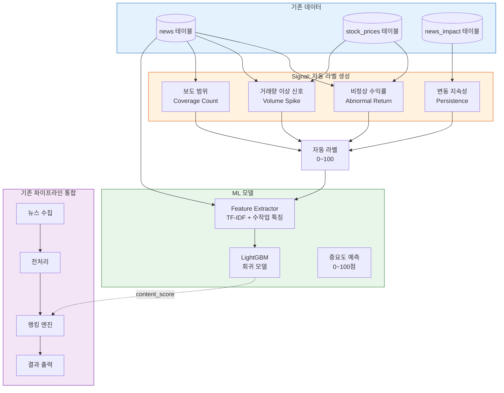
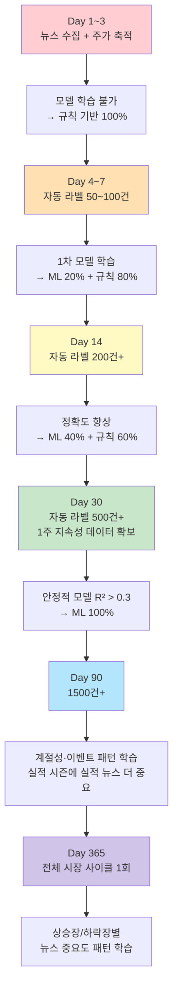

# Self-Supervised 금융 뉴스 중요도 예측 알고리즘

> 작성일: 2026-03-07
> 상태: 설계 (미구현)

---

전체 컨셉

[1단계 - 라벨링]
수집된 뉴스 중 일부를 사람이 중요도 점수(0~100) 부여
           ↓
[2단계 - 학습]
텍스트 특징 추출 → ML 모델 학습
           ↓
[3단계 - 예측]
새 뉴스 입력 → 학습된 모델이 중요도 자동 예측

==
1단계: 라벨링 데이터 생성
이미 DB에 뉴스가 쌓이고 있으므로, 수동 라벨링 도구를 만들면 됩니다:

$ python labeler.py

[1/50] 삼성전자, 10조원 규모 미국 반도체 공장 신설 결정
       소스: dart | 카테고리: 공시
       중요도 (0~100, s=skip): 92

[2/50] 반도체 업종 전반적 상승세 지속
       소스: naver | 카테고리: 섹터이슈
       중요도 (0~100, s=skip): 35
라벨링 결과를 CSV로 저장:


2단계: 특징(Feature) 추출
텍스트에서 ML 모델이 학습할 수 있는 특징을 추출합니다:

A. 텍스트 벡터 (의미 표현)
방법	장점	단점
TF-IDF	빠름, 의존성 없음	의미 파악 불가
Sentence Transformers	문맥 이해, 한국어 지원	모델 다운로드 필요 (~500MB)

# 방법 1: TF-IDF (가벼움)
from sklearn.feature_extraction.text import TfidfVectorizer
tfidf = TfidfVectorizer(max_features=3000)
text_features = tfidf.fit_transform(texts)

# 방법 2: 임베딩 (정확함)
from sentence_transformers import SentenceTransformer
model = SentenceTransformer('jhgan/ko-sroberta-multitask')  # 한국어 특화
embeddings = model.encode(texts)  # (N, 768) 벡터

B. 수작업 특징 (도메인 지식 반영)


C. 최종 특징 벡터

[텍스트 벡터 (TF-IDF 3000차원 또는 임베딩 768차원)]
  +
[수작업 특징 (~15차원)]
  =
[최종 입력 벡터]


3단계: 모델 학습
추천 모델
모델	정확도	속도	해석 가능성	추천
LightGBM	높음	빠름	중간 (feature importance)	1순위
Random Forest	중간	빠름	높음	2순위
Ridge Regression	낮음	매우 빠름	높음	베이스라인
MLP (신경망)	높음	보통	낮음	데이터 많을 때
학습 코드 구조


news_id,title,content,source,category,label
142,"삼성전자 10조 투자 결정","삼성전자는 이사회를...",dart,공시,92
143,"반도체 업종 상승세","반도체 관련 종목이...",naver,섹터이슈,35
필요한 라벨링 수: 최소 200~300건이면 기본 모델 학습 가능. 500건 이상이면 안정적.

4단계: 기존 파이프라인에 통합

collect → preprocess → save_to_db → fetch_prices → ranking
                                                      ↑
                                              ML 모델 예측값을
                                              content_score로 반영


피드백 루프: 모델 자동 개선
뉴스 발행 후 실제 주가 변동 데이터(news_impact)가 쌓이면, 사후 라벨을 자동 생성할 수 있습니다:


[사람 라벨링 300건] → 초기 모델 학습
         ↓
[모델이 예측] → 뉴스 발행
         ↓
[1일/1주 후] → 실제 주가 변동 확인 (news_impact 테이블)
         ↓
[자동 라벨 생성] → |change_pct_1d| * 10 = auto_label
         ↓
[모델 재학습] → 사람 라벨 + 자동 라벨 결합피드백 루프: 모델 자동 개선
뉴스 발행 후 실제 주가 변동 데이터(news_impact)가 쌓이면, 사후 라벨을 자동 생성할 수 있습니다:


[사람 라벨링 300건] → 초기 모델 학습
         ↓
[모델이 예측] → 뉴스 발행
         ↓
[1일/1주 후] → 실제 주가 변동 확인 (news_impact 테이블)
         ↓
[자동 라벨 생성] → |change_pct_1d| * 10 = auto_label
         ↓
[모델 재학습] → 사람 라벨 + 자동 라벨 결합


====

## 1. 개요

### 1.1 핵심 아이디어

사람이 뉴스 중요도를 라벨링하지 않고, **시장 반응(주가 변동/거래량) 자체를 정답(label)으로 사용**하여 모델을 자동으로 학습시키는 구조.

```
전통 지도학습:    사람 → "이 뉴스 85점"     → 모델 학습
Self-Supervised:  시장 → "이 뉴스 후 주가 5% 움직임" → 자동 라벨 → 모델 학습
```

### 1.2 왜 가능한가

현재 시스템이 이미 가진 데이터만으로 완전 자동화 가능:

| 이미 있는 것 | 역할 |
|-------------|------|
| `news` 테이블 | 뉴스 텍스트 (모델 입력) |
| `stock_prices` 테이블 | 주가 시계열 (자동 라벨 소스) |
| `news_impact` 테이블 | 1일/1주/1월 변동률 (이미 계산 중) |

### 1.3 기존 규칙 기반의 한계

현재 랭킹은 **본문 내용 자체**를 거의 보지 않음:

| 현재 사용 | 본문 활용 방식 |
|----------|--------------|
| Keyword Score | 고정 키워드 존재 여부만 확인 |
| Coverage Score | 제목 유사도 비교 (본문 무관) |
| Source Score | 소스명만 사용 (본문 무관) |
| Market Relevance | 종목코드 매핑 여부 (본문 무관) |

→ **"무엇을 말하는가"**보다 **"누가, 몇 번 말했는가"**에 의존하는 구조

---

## 2. 시스템 아키텍처



---

## 3. 자동 라벨 생성 (3개 Signal)

### 3.1 Signal 1: 비정상 수익률 (Abnormal Return)

뉴스 발행일 전후의 **시장 평균 대비 초과 수익률**을 계산.

```python
def compute_abnormal_return(repo, stock_code: str, news_date: str,
                            days: int = 1) -> float:
    """뉴스 발행일 기준 비정상 수익률 계산"""
    price_before = repo.get_price_on_date(stock_code, news_date)
    price_after = repo.get_price_after_date(stock_code, news_date, days=days)

    if not price_before or not price_after:
        return 0.0

    actual_return = (price_after['close'] - price_before['close']) / price_before['close']

    # 같은 기간 시장 평균 수익률 (KOSPI 또는 S&P500)
    market_return = get_market_return(news_date, days=days)

    # 비정상 수익률 = 실제 수익률 - 시장 평균
    abnormal_return = actual_return - market_return
    return abnormal_return * 100  # 퍼센트
```

**왜 비정상 수익률인가:**

```
시장 전체 +2%인데 삼성전자 +2.5% → 뉴스 영향 = +0.5% (약함)
시장 전체 +2%인데 삼성전자 +7%   → 뉴스 영향 = +5%   (강함!)
시장 전체 -1%인데 삼성전자 -1%   → 뉴스 영향 = 0%    (무관)
```

### 3.2 Signal 2: 거래량 이상 신호

주가 변동이 없더라도 **거래량 급증**은 시장이 해당 뉴스에 반응했다는 증거.

```python
def compute_volume_signal(repo, stock_code: str, news_date: str) -> float:
    """뉴스 발행 후 거래량 이상 정도 (평소 대비 배수)"""
    recent_prices = repo.get_recent_prices(stock_code, days=20)
    if len(recent_prices) < 5:
        return 0.0

    avg_volume = sum(p['volume'] for p in recent_prices[1:]) / (len(recent_prices) - 1)
    today_volume = recent_prices[0]['volume']

    if avg_volume == 0:
        return 0.0

    volume_ratio = today_volume / avg_volume  # 1.0 = 평소 수준
    return max(0, volume_ratio - 1.0)  # 초과분만 반환
```

| 거래량 배수 | 의미 |
|-----------|------|
| 1.0 | 평소 수준 → 0점 |
| 2.0 | 2배 → 시장 관심 |
| 3.0+ | 3배 이상 → 강한 반응 |

### 3.3 Signal 3: 변동 지속성 (Persistence)

1일 후에도 주가 영향이 유지되는지 확인하여, **일시적 노이즈 vs 지속적 영향**을 구분.

```python
ar_1d = abs(compute_abnormal_return(repo, stock_code, news_date, days=1))
ar_1w = abs(compute_abnormal_return(repo, stock_code, news_date, days=5))

# 1주 후에도 50% 이상 유지되면 지속적 영향
persistence = min(20, ar_1w * 5) if ar_1w > ar_1d * 0.5 else 0
```

| 시나리오 | 1일 후 | 1주 후 | 판정 |
|---------|--------|--------|------|
| 지속적 영향 | +3% | +2.5% | 높은 점수 |
| 일시적 반등 | +3% | +0.2% | 낮은 점수 |
| 무관 | +0.1% | +0.1% | 0점 |

---

## 4. 종목 무관 뉴스의 자동 라벨링

`stock_code`가 없는 거시경제 뉴스(금리, 환율, 정책 등)는 **시장 전체 반응**으로 라벨링:

```python
def auto_label_macro(repo, news_date: str) -> float:
    """거시경제 뉴스: 시장 전체 변동으로 자동 라벨 생성"""
    # KOSPI/S&P500 당일 변동률
    market_change = abs(get_market_return(news_date, days=1))

    # VIX 또는 변동성 변화 (선택)
    volatility_change = get_volatility_change(news_date)

    score = min(50, market_change * 15) + min(50, volatility_change * 10)
    return min(100, round(score, 1))
```

---

## 5. Coverage 사후 검증 (보조 Signal)

중복제거 단계에서 산출한 `coverage_count`도 보조 신호로 활용:

```python
def coverage_signal(news_item: dict) -> float:
    """다수 매체 보도 = 중요 뉴스일 가능성"""
    count = news_item.get('coverage_count', 1)
    return min(20, count * 5)
```

---

## 6. 최종 자동 라벨 공식

```python
def generate_self_supervised_label(repo, news_item: dict) -> float:
    stock_code = news_item.get('stock_code')
    news_date = news_item.get('published_at', '')[:10]

    if stock_code:
        # ── 종목 뉴스: 주가 반응이 핵심 ──
        ar = abs(compute_abnormal_return(repo, stock_code, news_date))
        price_score = min(50, ar * 10)
        # 0%→0점, 1%→10점, 3%→30점, 5%+→50점

        vol = compute_volume_signal(repo, stock_code, news_date)
        volume_score = min(30, vol * 15)
        # 평소→0점, 2배→15점, 3배+→30점

        ar_1w = abs(compute_abnormal_return(repo, stock_code, news_date, days=5))
        persistence = min(20, ar_1w * 5) if ar_1w > ar * 0.5 else 0

        market_signal = price_score + volume_score + persistence
        weight_market = 0.7
    else:
        # ── 거시 뉴스: 시장 전체 반응 ──
        market_signal = auto_label_macro(repo, news_date)
        weight_market = 0.5

    coverage = coverage_signal(news_item)
    weight_coverage = 1.0 - weight_market

    final = market_signal * weight_market + coverage * weight_coverage
    return min(100, round(final, 1))
```

### 자동 라벨 예시

| 뉴스 | 비정상수익률 | 거래량 배수 | 지속성 | 자동 라벨 |
|------|------------|-----------|--------|----------|
| 삼성전자 10조 투자 결정 | 4.2% | 3.1배 | 1주 후 +3% | **93점** |
| SK하이닉스 실적 발표 | 2.1% | 2.0배 | 1주 후 +0.5% | **46점** |
| 반도체 업종 전반 상승 | 0.3% | 1.2배 | 없음 | **6점** |
| 현대차 리콜 소식 | -1.5% | 1.8배 | 1주 후 -1% | **37점** |

---

## 7. 특징(Feature) 추출

### 7.1 텍스트 벡터 (2가지 옵션)

| 방법 | 차원 | 장점 | 단점 |
|------|------|------|------|
| **TF-IDF** | 3,000 | 빠름, 의존성 없음 | 의미 파악 불가 |
| **Sentence Transformers** | 768 | 문맥 이해, 한국어 지원 | 모델 다운로드 ~500MB |

```python
# 방법 1: TF-IDF
from sklearn.feature_extraction.text import TfidfVectorizer
tfidf = TfidfVectorizer(max_features=3000)
text_features = tfidf.fit_transform(texts)

# 방법 2: 임베딩 (정확도 우선 시)
from sentence_transformers import SentenceTransformer
model = SentenceTransformer('jhgan/ko-sroberta-multitask')  # 한국어 특화
embeddings = model.encode(texts)  # (N, 768)
```

### 7.2 수작업 특징 (~15차원)

텍스트에서 추출하는 **뉴스 도메인 특화 특징**:

```python
def extract_text_features(title: str, content: str) -> dict:
    text = f"{title} {content}"

    return {
        # ── 수치 관련 ──
        "has_percentage": bool(re.search(r'\d+%', text)),
        "has_large_amount": bool(re.search(r'\d+\s*[조억]', text)),
        "max_percentage": _extract_max_pct(text),
        "number_count": len(re.findall(r'\d+', text)),

        # ── 확정도 ──
        "is_confirmed": any(w in text for w in
            ['결정', '확정', '승인', '체결', 'announced', 'confirmed']),
        "is_speculation": any(w in text for w in
            ['가능성', '전망', '관측', '루머', 'rumor', 'speculation']),

        # ── 구조적 ──
        "title_length": len(title),
        "content_length": len(content),
        "has_stock_code": bool(re.search(r'\(\d{6}\)', text)),
        "has_company_name": bool(re.search(r'삼성|SK|현대|LG|카카오|네이버', text)),

        # ── 극단 표현 ──
        "has_superlative": any(w in text for w in
            ['사상 최대', '역대', '최초', 'record', 'all-time high']),
        "has_negative": any(w in text for w in
            ['급락', '폭락', '위기', '손실', '적자']),
        "has_positive": any(w in text for w in
            ['급등', '호실적', '최고', '흑자전환']),

        # ── 메타 ──
        "coverage_count": news_item.get('coverage_count', 1),
    }
```

### 7.3 최종 입력 벡터

```
[텍스트 벡터 (TF-IDF 3000차원 또는 임베딩 768차원)]
  +
[수작업 특징 (~15차원)]
  =
[최종 입력 벡터]
```

---

## 8. 학습 파이프라인

### 8.1 모델 선택

| 모델 | 정확도 | 속도 | 해석 가능성 | 추천 |
|------|--------|------|------------|------|
| **LightGBM** | 높음 | 빠름 | 중간 (feature importance) | 1순위 |
| Random Forest | 중간 | 빠름 | 높음 | 2순위 |
| Ridge Regression | 낮음 | 매우 빠름 | 높음 | 베이스라인 |
| MLP (신경망) | 높음 | 보통 | 낮음 | 데이터 많을 때 |

### 8.2 SelfSupervisedNewsModel 클래스

```python
import numpy as np
import pandas as pd
import lightgbm as lgb
import joblib
from scipy.sparse import hstack, csr_matrix
from sklearn.feature_extraction.text import TfidfVectorizer
from sklearn.model_selection import train_test_split, cross_val_score
from sklearn.metrics import r2_score, mean_absolute_error

from src.database.repository import Repository


class SelfSupervisedNewsModel:
    """Self-Supervised 금융 뉴스 중요도 예측 모델"""

    def __init__(self, repo: Repository):
        self.repo = repo
        self.tfidf = TfidfVectorizer(max_features=3000)
        self.model = lgb.LGBMRegressor(
            n_estimators=300,
            max_depth=6,
            learning_rate=0.05,
        )
        self.is_trained = False
        self.training_size = 0

    # ── 자동 라벨 생성 ──────────────────────────────────

    def generate_training_data(self, min_days_ago: int = 3) -> pd.DataFrame:
        """DB에서 3일 이상 지난 뉴스의 자동 라벨 생성"""
        old_news = self.repo.get_news_older_than(days=min_days_ago)

        records = []
        for news in old_news:
            label = generate_self_supervised_label(self.repo, dict(news))
            if label is None:
                continue

            features = extract_text_features(news['title'], news['content'])
            features['label'] = label
            features['text'] = f"{news['title']} {news['content']}"
            records.append(features)

        df = pd.DataFrame(records)
        logger.info(f"[SelfSup] 학습 데이터 생성: {len(df)}건")
        return df

    # ── 학습 ────────────────────────────────────────────

    def train(self) -> bool:
        """자동 생성된 라벨로 모델 학습"""
        df = self.generate_training_data()

        if len(df) < 50:
            logger.warning("[SelfSup] 학습 데이터 부족 (최소 50건 필요)")
            return False

        # 텍스트 벡터화
        text_vec = self.tfidf.fit_transform(df['text'])

        # 수작업 특징
        feature_cols = [c for c in df.columns if c not in ('text', 'label')]
        manual_vec = df[feature_cols].values

        X = hstack([text_vec, csr_matrix(manual_vec)])
        y = df['label'].values

        # 학습 + 검증
        X_train, X_val, y_train, y_val = train_test_split(X, y, test_size=0.2)
        self.model.fit(X_train, y_train)

        val_pred = self.model.predict(X_val)
        r2 = r2_score(y_val, val_pred)
        mae = mean_absolute_error(y_val, val_pred)
        logger.info(f"[SelfSup] 검증 R²={r2:.3f}, MAE={mae:.1f}")

        # 전체 데이터로 재학습
        self.model.fit(X, y)
        self.is_trained = True
        self.training_size = len(df)
        return True

    # ── 예측 ────────────────────────────────────────────

    def predict(self, title: str, content: str) -> float:
        """새 뉴스의 중요도 예측 (0~100)"""
        if not self.is_trained:
            return 50.0  # 학습 전 기본값

        text = f"{title} {content}"
        text_vec = self.tfidf.transform([text])
        features = extract_text_features(title, content)
        manual_vec = np.array([[features[k] for k in sorted(features)]])

        X = hstack([text_vec, csr_matrix(manual_vec)])
        score = self.model.predict(X)[0]
        return max(0, min(100, round(score, 1)))

    # ── 자동 재학습 ─────────────────────────────────────

    def retrain_if_needed(self, min_new_data: int = 100):
        """새 데이터가 충분히 쌓이면 자동 재학습"""
        new_count = self.repo.count_news_since_last_train()
        if new_count >= min_new_data:
            logger.info(f"[SelfSup] 새 데이터 {new_count}건 → 재학습 시작")
            self.train()
            self.save()

    # ── 저장/로드 ───────────────────────────────────────

    def save(self, path: str = 'models/importance_model.pkl'):
        joblib.dump({
            'tfidf': self.tfidf,
            'model': self.model,
            'training_size': self.training_size,
        }, path)

    def load(self, path: str = 'models/importance_model.pkl'):
        data = joblib.load(path)
        self.tfidf = data['tfidf']
        self.model = data['model']
        self.training_size = data.get('training_size', 0)
        self.is_trained = True

    def load_or_train(self, path: str = 'models/importance_model.pkl'):
        try:
            self.load(path)
            logger.info(f"[SelfSup] 기존 모델 로드 (학습 데이터 {self.training_size}건)")
        except FileNotFoundError:
            logger.info("[SelfSup] 저장된 모델 없음 → 신규 학습 시작")
            self.train()
            self.save(path)
```

---

## 9. 기존 파이프라인 통합

### 9.1 main.py 수정

```python
def main():
    ...
    # 기존 파이프라인
    news_items = collect_news(config)
    news_items = preprocess(news_items, repo)
    save_to_db(repo, news_items)
    fetch_stock_prices(repo)

    # Self-Supervised 모델
    ss_model = SelfSupervisedNewsModel(repo)
    ss_model.load_or_train()          # 저장된 모델 로드, 없으면 학습
    ss_model.retrain_if_needed()      # 새 데이터 쌓이면 자동 재학습

    # 랭킹 시 ML 점수 반영
    run_rankings(repo, config, ss_model)
    ...
```

### 9.2 랭킹 엔진 스코어 통합

```python
# ranking/engine.py
class NewsRankingEngine:
    def __init__(self, config, repo, ss_model=None):
        ...
        self.ss_model = ss_model

    def _fallback_news_ranking(self, batch):
        for item in batch:
            # 기존 4개 점수 (배점 축소: 각 0~20)
            coverage_score = min(20, coverage_count * 7)
            keyword_score = int(self._compute_keyword_score(text) * 0.8)
            source_score = int(SOURCE_CREDIBILITY.get(source, 10) * 0.8)
            relevance_score = ...

            # ML 기반 본문 중요도 (신규: 0~20)
            content_score = 10  # 기본값
            if self.ss_model and self.ss_model.is_trained:
                ml_score = self.ss_model.predict(item['title'], item['content'])
                rule_score = self._rule_based_content_score(item)

                # 데이터 양에 따라 ML 비중 조정
                confidence = min(1.0, self.ss_model.training_size / 500)
                content_score = ml_score * confidence + rule_score * (1 - confidence)
                content_score = content_score * 0.2  # 0~100 → 0~20 스케일

            total = coverage_score + keyword_score + source_score \
                    + relevance_score + content_score
```

### 9.3 스코어 구성 변경

```
기존 (4항목, 각 25점):
  Coverage(25) + Keyword(25) + Source(25) + Relevance(25) = 100점

변경 (5항목, 각 20점):
  Coverage(20) + Keyword(20) + Source(20) + Relevance(20) + Content(20) = 100점
                                                             ↑ ML 예측
```

---

## 10. 시간에 따른 자동 개선 흐름



### 신뢰도 기반 점진적 전환

```python
def get_content_score(self, item, ss_model):
    if ss_model and ss_model.is_trained:
        ml_score = ss_model.predict(item['title'], item['content'])
        rule_score = self._rule_based_content_score(item)

        # 학습 데이터 500건 도달 시 ML 100% 전환
        confidence = min(1.0, ss_model.training_size / 500)
        return ml_score * confidence + rule_score * (1 - confidence)
    else:
        return self._rule_based_content_score(item)
```

| training_size | confidence | ML 비중 | 규칙 비중 |
|--------------|-----------|---------|----------|
| 0 | 0.0 | 0% | 100% |
| 100 | 0.2 | 20% | 80% |
| 250 | 0.5 | 50% | 50% |
| 500+ | 1.0 | 100% | 0% |

---

## 11. 규칙 기반과의 비교

| 항목 | 규칙 기반 (현재) | Self-Supervised |
|------|----------------|-----------------|
| 라벨링 | 불필요 | 불필요 (시장이 제공) |
| 학습 데이터 | 없음 | 자동 축적 |
| 본문 이해 | 키워드 매칭만 | TF-IDF/임베딩으로 문맥 파악 |
| 시간 경과 | 성능 고정 | **자동 개선** |
| 새로운 패턴 | 수동 키워드 추가 필요 | 자동 학습 |
| Cold Start | 즉시 작동 | 3~7일 필요 |
| 해석 가능성 | 높음 (점수 분해) | 중간 (feature importance) |
| 시장 상황 적응 | 불가 | 자동 (재학습) |

**최적 전략:** 초기에는 규칙 기반, 데이터가 쌓이면 Self-Supervised로 점진적 전환.

---

## 12. 필요 의존성

### 12.1 필수

```
lightgbm>=4.0        # ML 모델
scikit-learn>=1.3     # 전처리, 평가, TF-IDF
joblib>=1.3           # 모델 저장/로드
```

### 12.2 선택 (정확도 향상)

```
sentence-transformers>=2.2   # 한국어 임베딩 (TF-IDF 대체)
```

### 12.3 파일 구조 (구현 시)

```
a_0305/
├── src/
│   └── ml/
│       ├── labeler.py              # 자동 라벨 생성 로직
│       ├── features.py             # 특징 추출
│       └── model.py                # SelfSupervisedNewsModel
├── models/
│   └── importance_model.pkl        # 학습된 모델 (자동 생성)
└── requirements.txt                # lightgbm, scikit-learn 추가
```
