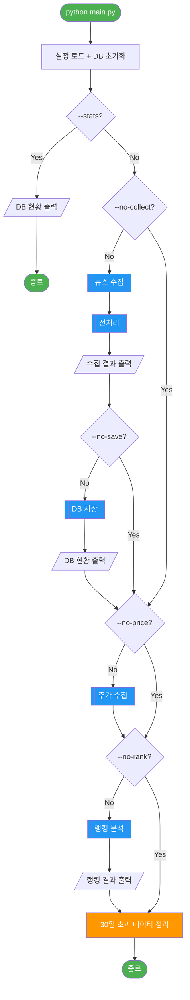
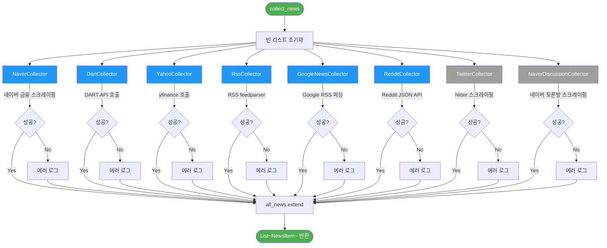
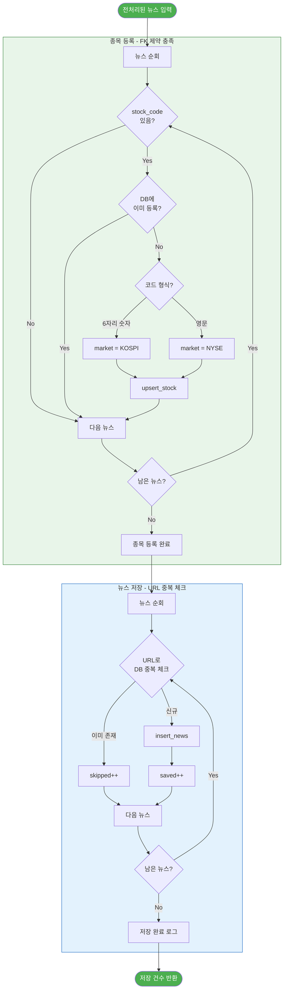
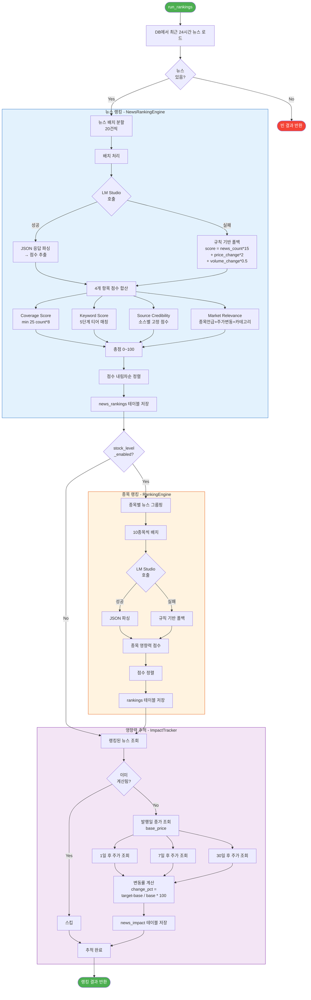
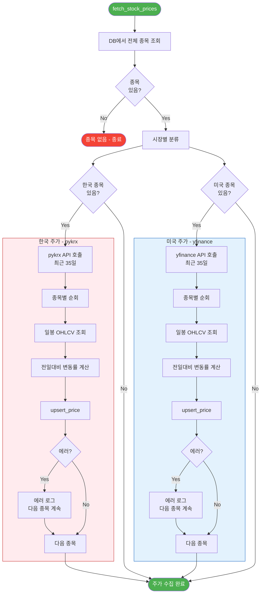

# 주식 랭킹 뉴스 시스템 - 노드 기반 워크플로우

> 작성일: 2026-03-07

---

## 1. 전체 파이프라인 워크플로우



---

## 2. 뉴스 수집 노드 상세



> N7(Twitter), N8(네이버토론방)은 현재 **비활성** 상태 (회색)

---

## 3. 전처리 파이프라인 노드 상세

```mermaid
flowchart TD
    IN([List~NewsItem~ 입력]) --> DEDUP

    %% ── 중복 제거 ──
    subgraph DEDUP_BOX [1단계: 중복 제거 - dedup.py]
        DEDUP[뉴스 순회 시작] --> COMPARE{seen_titles와\n제목 유사도 비교}
        COMPARE -->|유사도 >= 80%| DUP_YES[중복 판정]
        DUP_YES --> COVERAGE[원본에 coverage_count++\ncoverage_sources 추가]
        COVERAGE --> NEXT_ITEM[다음 뉴스]
        COMPARE -->|유사도 < 80%| DUP_NO[신규 판정]
        DUP_NO --> ADD_UNIQUE[unique 리스트에 추가\ncoverage_count=1 초기화]
        ADD_UNIQUE --> NEXT_ITEM
        NEXT_ITEM --> MORE{남은 뉴스?}
        MORE -->|Yes| COMPARE
        MORE -->|No| DEDUP_OUT[중복 제거 완료]
    end

    %% ── 종목 매핑 ──
    DEDUP_OUT --> MAP

    subgraph MAP_BOX [2단계: 종목 매핑 - stock_mapper.py]
        MAP[뉴스 순회 시작] --> T1{1순위:\n종목명 매칭\nDB + pykrx 사전}
        T1 -->|매칭| SET_CODE[stock_code, stock_name 설정]
        T1 -->|불일치| T2{2순위:\n6자리 숫자 패턴}
        T2 -->|매칭| SET_CODE
        T2 -->|불일치| T3{3순위:\n영문 1~5자 티커}
        T3 -->|매칭| SET_CODE
        T3 -->|불일치| SKIP[매핑 없음]
        SET_CODE --> MAP_NEXT[다음 뉴스]
        SKIP --> MAP_NEXT
        MAP_NEXT --> MAP_MORE{남은 뉴스?}
        MAP_MORE -->|Yes| T1
        MAP_MORE -->|No| MAP_OUT[종목 매핑 완료]
    end

    %% ── 카테고리 분류 ──
    MAP_OUT --> CAT

    subgraph CAT_BOX [3단계: 카테고리 분류 - categorizer.py]
        CAT[뉴스 순회 시작] --> HAS_CAT{이미 카테고리\n있음?}
        HAS_CAT -->|Yes - DART 공시 등| CAT_SKIP[건너뜀]
        HAS_CAT -->|No| KW_MATCH[제목+내용에서\n8개 카테고리 키워드 매칭]
        KW_MATCH --> BEST{최다 매칭\n카테고리?}
        BEST -->|있음| SET_CAT[category 설정]
        BEST -->|없음| NO_CAT[미분류]
        SET_CAT --> CAT_NEXT[다음 뉴스]
        CAT_SKIP --> CAT_NEXT
        NO_CAT --> CAT_NEXT
        CAT_NEXT --> CAT_MORE{남은 뉴스?}
        CAT_MORE -->|Yes| HAS_CAT
        CAT_MORE -->|No| CAT_OUT[카테고리 분류 완료]
    end

    CAT_OUT --> OUT([전처리된 List~NewsItem~ 반환])

    style IN fill:#4CAF50,color:#fff
    style OUT fill:#4CAF50,color:#fff
    style DEDUP_BOX fill:#E3F2FD,stroke:#1565C0
    style MAP_BOX fill:#E8F5E9,stroke:#2E7D32
    style CAT_BOX fill:#FFF3E0,stroke:#E65100
```



---

## 4. DB 저장 노드 상세



---

## 5. 랭킹 분석 노드 상세



---

## 6. 주가 수집 노드 상세



---

## 7. 데이터 흐름 요약도

```mermaid
flowchart LR
    subgraph SOURCES [뉴스 소스]
        S1[네이버]
        S2[DART]
        S3[Yahoo]
        S4[RSS]
        S5[Google]
        S6[Reddit]
    end

    subgraph PREPROCESS [전처리]
        P1[중복 제거]
        P2[종목 매핑]
        P3[카테고리 분류]
    end

    subgraph DATABASE [(SQLite)]
        D1[(stocks)]
        D2[(news)]
        D3[(stock_prices)]
        D4[(news_rankings)]
        D5[(news_impact)]
    end

    subgraph PRICE [주가 소스]
        PR1[pykrx\n한국]
        PR2[yfinance\n미국]
    end

    subgraph RANKING [랭킹]
        R1[LM Studio\nLLM]
        R2[규칙 기반\nFallback]
    end

    subgraph OUTPUT [출력]
        O1[터미널\n랭킹 테이블]
    end

    SOURCES -->|NewsItem| P1
    P1 -->|유니크 뉴스| P2
    P2 -->|종목코드 부여| P3
    P3 -->|카테고리 부여| D2
    P3 --> D1

    PR1 --> D3
    PR2 --> D3

    D2 --> R1
    D3 --> R1
    R1 -->|실패 시| R2
    R1 --> D4
    R2 --> D4

    D4 --> D5
    D3 --> D5

    D4 --> O1

    style SOURCES fill:#E3F2FD,stroke:#1565C0
    style PREPROCESS fill:#E8F5E9,stroke:#2E7D32
    style DATABASE fill:#FFF3E0,stroke:#E65100
    style PRICE fill:#FFEBEE,stroke:#C62828
    style RANKING fill:#F3E5F5,stroke:#7B1FA2
    style OUTPUT fill:#E0F2F1,stroke:#00695C
```
